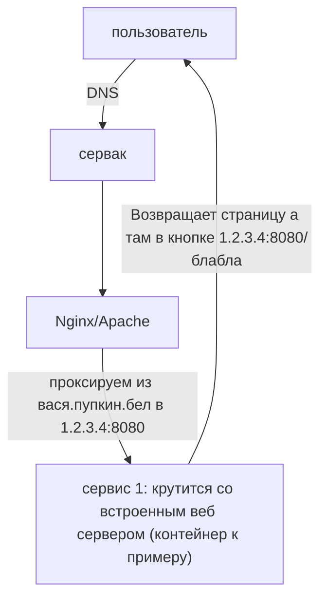

---
{"dg-publish":true,"permalink":"/public/posts/post0/","title":"На захосченом сайте \"example.com\" кнопка с ссылкой \"< local hostname >/< url >\". А как? [[post0|Read]]","tags":["blog","DevOps","nginx"]}
---

# Локальные ссылки в сервисе при проксировании

С проблемой столкнулся столько раз что мне кажется что об этом стоит написать. 


<div class="transclusion internal-embed is-loaded"><div class="markdown-embed">


## Описание проблемы:



</div></div>


Попытка как то редиректить - смерть.  Тяжело отделить обычное использование сайта от обращений к кривым ссылкам. Велик шанс нарваться на ошибку TOO_MANY_REDIRECTS. Ну или вы так зашакалите адресата редиректами что сервис вам ответит "Извините вы ошиблись адресом". По крайней мере у меня не вышло если знаете как то [[Public/Index#Evgen Buiko\|пишите]]. Но решение нашлось куда топорнее
## Мой реальный пример
 В моём частном случае сервисов что я хостил было 2 на том же серваке что и Nginx: 
1. Gitlab. Целую руки разработчиков. С ним всё норм и он под такое настраивается просто из UI
2. Open project в docker контейнере. Вот тут то и было всё выше описанное. Впринципе с учётом того что это такое то и не удивительно[^1]. Но отставить нытьё. Работем с тем что есть.  По идее можно полезть в контейнер и .... Нее я конечно больной но не на клинической же стадии. 
## Решение:


<div class="transclusion internal-embed is-loaded"><div class="markdown-embed">


### 1. Nginx sub_filter или его аналог в Apache
Штука до нельзя простая от того и рабочая - парсит контент страницы подменяя аргумент 1 на аргумент 2. 

> [!warning]  Однако
> Вытекающий из принципа работы команды минус: данный метод требует убрать компрессию

</div></div>


Как я понял это должно быть прописано в самом конце. Но это не точно)

Пример:

```nginx
location ... {
		...
	proxy_set_header Accept-Encoding ""; 
	# Fix direct links  
	sub_filter "1.2.3.4:8080/" "вася.пупкин.бел/";  
	sub_filter_once off;
}
```


<div class="transclusion internal-embed is-loaded"><div class="markdown-embed">


### 2. Сделать нормально
Ага да может быть когда нибудь. Вообще такой проблемы не должно было быть ибо:
1. Люди либо сервисы по серверам раскидывают
2. Либо у сервисов отключают встроенный веб сервер


</div></div>


Если вы оказались здесь то смею предположить что вам ситуация по другому сделать не распологает.

[[Public/Index\|Главная страница]]

[^1]: Экскурс в историю. Open Project не является самостоятельным баг трекер проектом. Ребята в 2010-ые взяли open-source проект Redmine, прирастили через ангуляр js и вагон плагинов, наняли пару туш для сапорта и начали это продавать. Но справедливости ради сохранились они мне кажется  лучше конкурентов (RedmineUp, ChillProject )