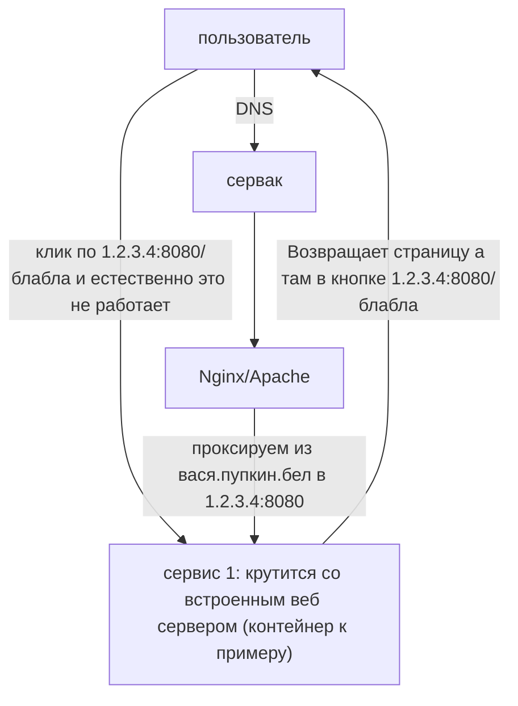

---
{"dg-publish":true,"permalink":"/Public/posts/post0/","title":"На захосченом сайте `example.com` кнопка с ссылкой `<local hostname>/<url>`. А как? [[post0|Read]]","tags":["blog","DevOps"]}
---

# Локальные ссылки в сервисе при проксировании


<div class="transclusion internal-embed is-loaded"><div class="markdown-embed">


С проблемой столкнулся столько раз что мне кажется что об этом стоит написать. 
## Описание проблемы:



Попытка как то редиректить невозможно. Логично но если тупишь то может оказаться неочевидно: **как только ты пользователю отдал ссылку 1.2.3.4:8080/блабла ты уже бессилен ибо обращение по ней до тебя никогда не долетит хоть в схеме это и нарисовано**
## Решение:

### 1. Сделать нормально

Ага да может быть когда нибудь. Если вы в такой ситуации то этот пункт вам с большой долей вероятности не подходит ибо тут на мой взгляд архитектурно хочется плакать. Но всё же пропишу подробнее.
#### Встроенный веб сервер
Это на всё время использования для вас окажется третьей ногой которой вы не всегда можете управлять. В моём частном случае один из таких сервисов был gitlab. Они рекомендуют отключать встроенный nginx если вы используете собственный. Абсолютно с ними согласен. Если такая возможность есть - делайте это обязательно. 
### 2. Nginx sub_filter или его аналог в Apache
Штука до нельзя простая от того и рабочая - парсит контент страницы подменяя аргумент 1 на аргумент 2. 

> [!warning]  Однако
> Серьёзный вытекающий из принципа работы команды минус: данный метод требует убрать компрессию

Как я понял это должно быть прописано в самом конце. Но это не точно)

Пример:

```nginx
location ... {
		...
	proxy_set_header Accept-Encoding ""; 
	# Fix direct links  
	sub_filter "1.2.3.4:8080/" "вася.пупкин.бел/";  
	sub_filter_once off;
}
```


</div></div>


[[Public/Index\|Главная страница]]