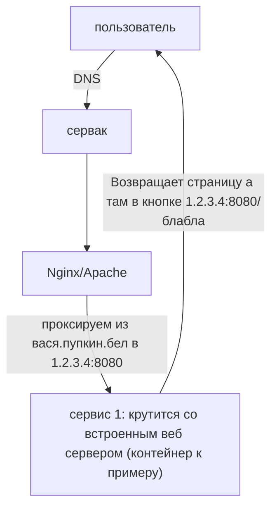

---
{"dg-publish":true,"permalink":"/public/posts/post0/","title":"На захосченом сайте `example.com` кнопка с ссылкой `<local hostname>/<url>`. А как? [[post0|Read]]","tags":["blog","DevOps"]}
---

# Локальные ссылки в сервисе при проксировании


<div class="transclusion internal-embed is-loaded"><div class="markdown-embed">


С проблемой столкнулся столько раз что мне кажется что об этом стоит написать. 
## Описание проблемы:



Попытка как то редиректить - смерть. А если быть точнее то велик шанс ошибки TOO_MANY_REDIRECTS. Даже если вы обошли её вы нарветёсь на вторую проблему: вы так зашакалили адресата редиректами что сервис вам ответил "Извините вы ошиблись адресом". По крайней мере у меня не вышло если знаете как то [[Public/Index#Evgen Buiko\|пишите]]. Но решение нашлось куда топорнее
### Мой реальный пример

 В моём частном случае сервисов что я хостил было 2 на том же серваке что и Nginx: 
1. Gitlab. Целую руки разработчиков. С ним всё норм и он под такое настраивается просто из UI
2. Open project в docker контейнере. Вот тут то и было всё выше описанное. Впринципе с учётом того что это такое то не удивительно[^1]. Но отставить нытьё. Работем с тем что есть.  По идее можно полезть в контейнер и .... Нее я конечно больной но не на клинической же стадии. 
## Решение:

### 1. Nginx sub_filter или его аналог в Apache
Штука до нельзя простая от того и рабочая - парсит контент страницы подменяя аргумент 1 на аргумент 2. 

> [!warning]  Однако
> Вытекающий из принципа работы команды минус: данный метод требует убрать компрессию

Как я понял это должно быть прописано в самом конце. Но это не точно)

Пример:

```nginx
location ... {
		...
	proxy_set_header Accept-Encoding ""; 
	# Fix direct links  
	sub_filter "1.2.3.4:8080/" "вася.пупкин.бел/";  
	sub_filter_once off;
}
```

### 2. Сделать нормально

Ага да может быть когда нибудь. Если вы в такой ситуации то с большой долей вероятности вы такой же больной как и я) Но если вдруг новенькие всё же пропишу подробнее.
#### Встроенный веб сервер
Это на всё время использования для вас окажется третьей ногой которой вы не всегда можете управлять. gitlab рекомендуют в документации отключать встроенный nginx если вы используете собственный. Абсолютно с ними согласен. Если такая возможность есть - делайте это обязательно. 


[^1]: Экскурс в историю. Open Project не является самостоятельным баг трекер проектом. Ребята в 2000-ые взяли open-source проект redmine, наплодили поверх плагинов, наняли пару туш для сапорта и начали это продавать. И блин это жеж продаётся и используется...

</div></div>


[[Public/Index\|Главная страница]]