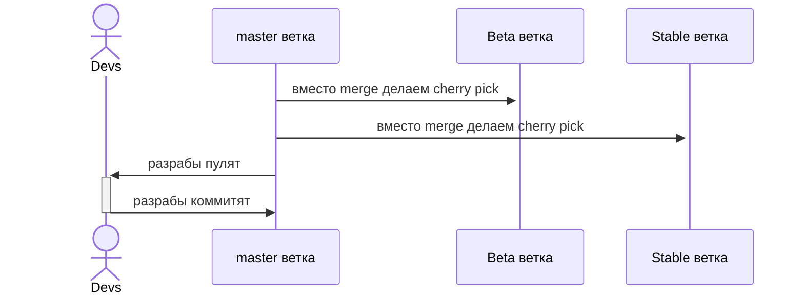
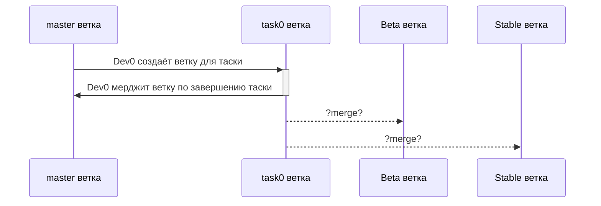

---
{"dg-publish":true,"permalink":"/public/posts/post4/","title":"Ну и естественно куда ведь без нитакусиков. Git[2] [[post4|Read]]","tags":["blog","DevOps","Git"]}
---

Если не понятно о чём речь то ранее в :
* [[Public/posts/post2\|Познаём Flow но не рэперский а гитовский. Git(0)]]
* [[Public/posts/post3\|Мы переросли эти ваши Flow и branches. Теперь мы серьезные ребята из TBD. Git(1)]]

# Нитакусики

Повидал я значит такое:

## OMP System

Схема 0: как получилось

Если бы у нас был бы не компилируемый язык или проект поменьше (сборка обходилась в пол часа) то было бы вот так: 

Схема 1: как хотелось

Почему вообще так: автор покинул компанию в 2017-ом и узнать было просто не у кого. Тяжело сказать на что это похоже. 

[[Public/Index\|Главная страница]]